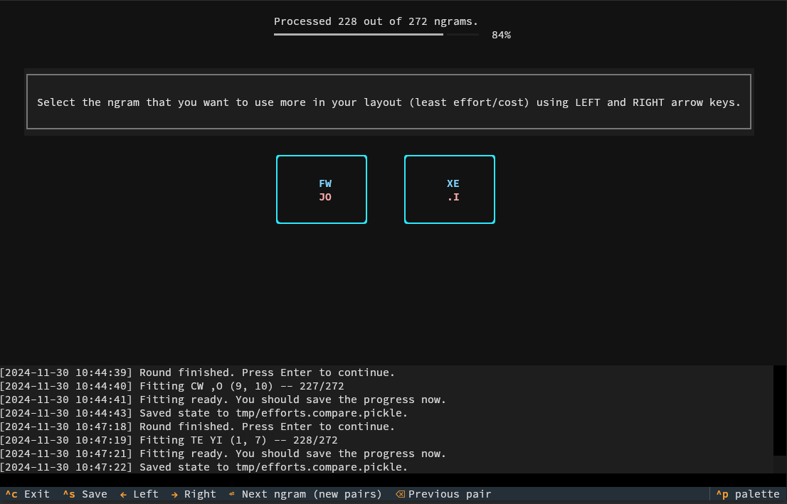

# granite-tools

Tools used in creation of the [Granite](https://github.com/fohrloop/granite-layout) keyboard layout. Main features:

1. Toolkit for scoring cost for key sequences ("ngrams"): [[Docs](./docs/scoring-key-efforts.md)]
2. Ngram frequency analysis tools: `ngram_show` and `ngram_compare`. [[Docs](./docs/ngram-frequency-analysis.md)]

# Installing

## Install option A: uv

You can use [uv](https://docs.astral.sh/uv/) and let it handle python (virtual) environments for you. In this case

- install [uv](https://docs.astral.sh/uv/)
- Clone this repo or just download the contents
- Use `uv run <command>` instead of `<command>` (must be executed in this directory). It's also possible to activate the virtual environment in the created `.venv` directory (after first run), if you want that.
- This might be the right option for you if you are not familiar with python and virtual environments and it's a bit more hassle free.


## Install option B: python virtual environments

- Use **python 3.12** in a fresh virtual environment (this is important as package versions are pinned so you may mess up your system if you don't)

```
python -m pip install git+https://github.com/fohrloop/granite-tools.git
```


# Examples / Screenshots


### Screenshots from granite-scorer-baseline


### Screenshots from granite-scorer-view


### Screenshots from granite-scorer-compare



### Example: Showing ngram files with `ngram_show`


```
❯ ngram_show ./ngrams/kla-english -s 2 --plot -n 10
────────────────── kla-english ───────────────────
   1: e␣ ▇▇▇▇▇▇▇▇▇▇▇▇▇▇▇▇▇▇▇▇▇▇ 2.88
   2: ␣t ▇▇▇▇▇▇▇▇▇▇▇▇▇▇▇▇▇▇ 2.31
   3: th ▇▇▇▇▇▇▇▇▇▇▇▇▇▇▇ 1.98
   4: he ▇▇▇▇▇▇▇▇▇▇▇▇▇▇ 1.88
   5: s␣ ▇▇▇▇▇▇▇▇▇▇▇▇▇ 1.75
   6: ␣a ▇▇▇▇▇▇▇▇▇▇▇▇▇ 1.73
   7: d␣ ▇▇▇▇▇▇▇▇▇▇▇▇ 1.52
   8: in ▇▇▇▇▇▇▇▇▇▇▇ 1.46
   9: t␣ ▇▇▇▇▇▇▇▇▇▇ 1.32
  10: er ▇▇▇▇▇▇▇▇▇▇ 1.28
```

## Example: `ngram_compare`

Compare two ngram corpora. Example:

```
❯ ngram_compare /home/fohrloop/code/granite-english-ngrams/ngrams/english/ /home/fohrloop/code/granite-code-ngrams/ngrams/code/  --plot -s 3 -n 20  -
i --diff -w
─────────────────────english────────────────────── ───────────────────────code───────────────────────
 1: the   ▇▇▇▇▇▇▇▇▇▇▇▇▇▇▇▇▇▇▇▇ 2.49                    1 (+2826): --- ▇▇▇▇▇▇▇▇▇▇▇▇▇▇▇▇▇▇▇▇ 0.61
 2: ing   ▇▇▇▇▇▇▇▇▇▇▇ 1.43                             2 (   +4): ion ▇▇▇▇▇▇▇▇▇▇▇▇▇▇▇ 0.47
 3: and   ▇▇▇▇▇▇▇▇▇▇ 1.26                              3 (   +6): ent ▇▇▇▇▇▇▇▇▇▇▇▇▇▇ 0.42
 4: hat   ▇▇▇▇▇ 0.61                                   4 (  +33): con ▇▇▇▇▇▇▇▇▇▇▇▇▇ 0.41
 5: her   ▇▇▇▇▇ 0.60                                   5 (   +7): tio ▇▇▇▇▇▇▇▇▇▇▇▇▇ 0.39
 6: ion   ▇▇▇▇▇ 0.56                                   6 (   -5): the ▇▇▇▇▇▇▇▇▇▇ 0.31
 7: tha   ▇▇▇▇ 0.55                                    7 (   -5): ing ▇▇▇▇▇▇▇▇▇▇ 0.30
 8: for   ▇▇▇▇ 0.55                                    8 (  +17): ate ▇▇▇▇▇▇▇▇▇▇ 0.30
 9: ent   ▇▇▇▇ 0.53                                    9 ( +275): sel ▇▇▇▇▇▇▇▇▇▇ 0.29
10: thi   ▇▇▇▇ 0.50                                   10 ( +194): ass ▇▇▇▇▇▇▇▇▇ 0.27
11: all   ▇▇▇▇ 0.47                                   11 (  +68): ect ▇▇▇▇▇▇▇▇▇ 0.26
12: tio   ▇▇▇▇ 0.45                                   12 (  +37): ons ▇▇▇▇▇▇▇▇ 0.25
13: ver   ▇▇▇ 0.42                                    13 (  +88): ort ▇▇▇▇▇▇▇▇ 0.25
14: you   ▇▇▇ 0.42                                    14 ( +240): ser ▇▇▇▇▇▇▇▇ 0.25
15: ter   ▇▇▇ 0.40                                    15 ( +456): elf ▇▇▇▇▇▇▇▇ 0.24
16: ere   ▇▇▇ 0.38                                    16 ( +890): def ▇▇▇▇▇▇▇▇ 0.24
17: his   ▇▇▇ 0.38                                    17 (  +64): ame ▇▇▇▇▇▇▇▇ 0.23
18: ith   ▇▇▇ 0.36                                    18 ( +214): por ▇▇▇▇▇▇▇▇ 0.23
19: wit   ▇▇▇ 0.35                                    19 (   -4): ter ▇▇▇▇▇▇▇ 0.23
20: was   ▇▇▇ 0.33                                    20 (  +30): est ▇▇▇▇▇▇▇ 0.22
25: ate   ▇▇▇ 0.32                                    22 (  -14): for ▇▇▇▇▇▇▇ 0.22
37: con   ▇▇ 0.25                                     60 (  -47): ver ▇▇▇▇▇ 0.16
49: ons   ▇▇ 0.22                                     71 (  -68): and ▇▇▇▇ 0.13
50: est   ▇▇ 0.22                                     95 (  -84): all ▇▇▇▇ 0.11
79: ect   ▇ 0.17                                     111 ( -101): thi ▇▇▇ 0.10
81: ame   ▇ 0.16                                     127 ( -110): his ▇▇▇ 0.10
101: ort  ▇ 0.15                                     141 ( -136): her ▇▇▇ 0.09
204: ass  ▇ 0.10                                     145 ( -127): ith ▇▇▇ 0.09
232: por  ▇ 0.09                                     155 ( -136): wit ▇▇▇ 0.09
254: ser  ▇ 0.08                                     189 ( -173): ere ▇▇ 0.07
284: sel  ▇ 0.08                                     505 ( -498): tha ▇ 0.04
471: elf   0.05                                      603 ( -599): hat ▇ 0.03
906: def   0.03                                     1022 (-1008): you ▇ 0.02
2827: ---  0.00                                     3196 (-3176): was  0.01
```