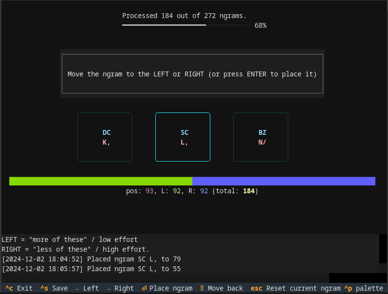
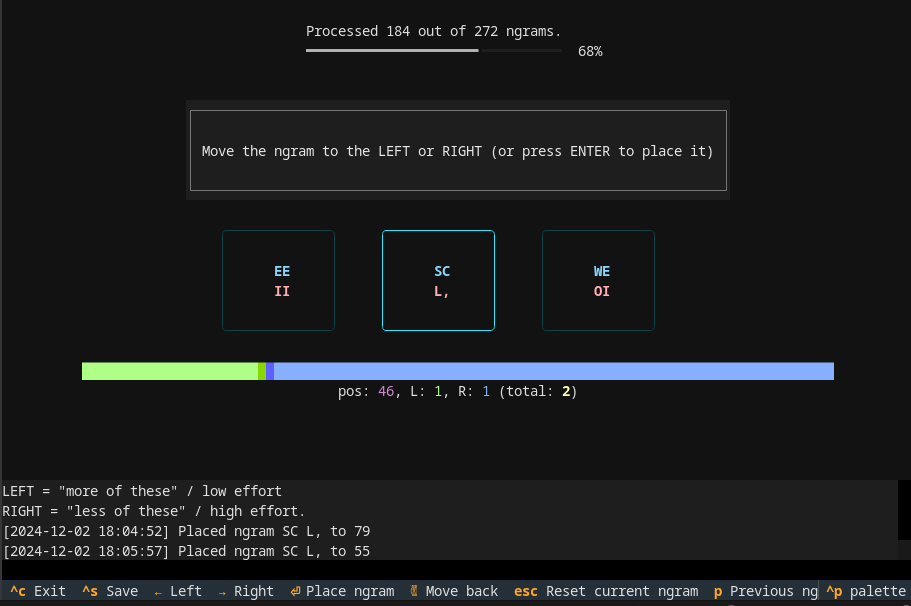
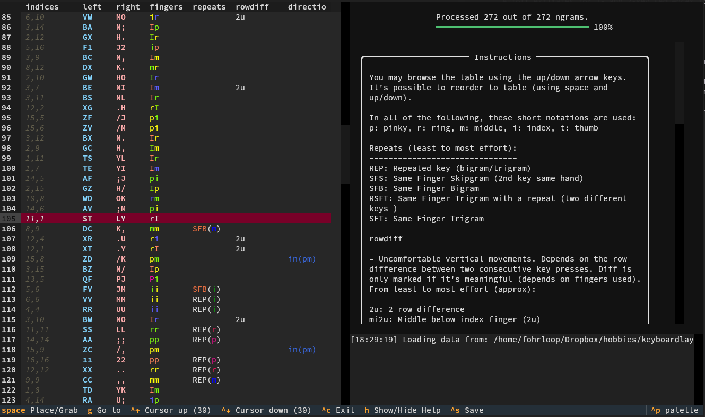
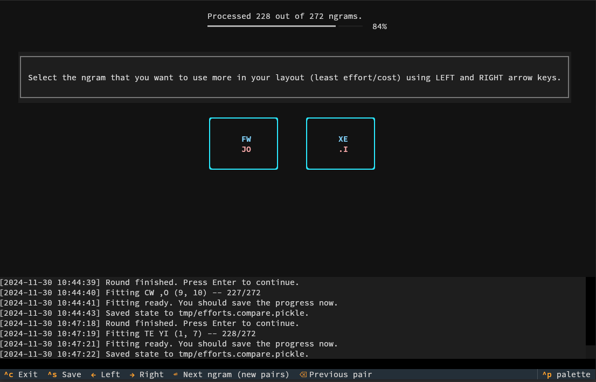

# Scoring Key Efforts

The [granite-tools](https://github.com/fohrloop/granite-tools) provides a toolkit for creating effort estimates for 1- and 2-key sequences for keyboard layout optimization.

# How to use this?

The full process is:

1. **Config file**: Create a keyboard configuration yaml file. Copy the `examples/keyseq_effort.yml` and use it as a base.
2. **Initial order**: Create initial order with `granite-scorer-baseline`. Let's say you save the result it as `myfile`. This takes approximately 4.5 hours (16 keys per side).
3. **View the initial order** (optional): Use the `granite-scorer-view` to see the initial order. You may also do some fine tuning to the order. Tip: It's possible to use the `granite-scorer-view` also with partial initial order file (e.g. if you find something that's a bit off while working with `granite-scorer-baseline`) 
4. **Create comparison file**. Use the `granite-scorer-compare` with the initial order to create comparisons of different key sequences.  This takes approximately 12 hours (16 keys per side).

> [!NOTE]
> If you're using [uv](https://docs.astral.sh/uv/), you will need to run `uv run command` instead of `command`.

## granite-scorer-baseline

Application for creating an initial ordered ngram table. Launch:

```
❯ granite-scorer-baseline <ngram-order-file> <config-file-yml>
```

for example:

```
❯ granite-scorer-baseline myfile examples/keyseq_effort.yml
```


### Screenshots from granite-scorer-baseline





## granite-scorer-view

Application for viewing an ordered ngram table. Launch:

```
❯ granite-scorer-view <ngram-order-file> <config-file-yml>
```

for example:

```
❯ granite-scorer-view myfile examples/keyseq_effort.yml
```

- Note that it's also possible to fine tune the order here; you may use space key and arrow up/down to move rows one by one. Just remember to save your progress (it overwrites the original file).

### Screenshots from granite-scorer-view



## granite-scorer-compare

Application for viewing an ordered ngram table. Launch:

```
❯ granite-scorer-compare <ngram-order-file|saved-pickle-file> <config-file-yml>
```

for example:

```
❯ granite-scorer-compare myfile examples/keyseq_effort.yml
```

- In this application, you will score each key sequence (ngram) 10 times against a random key sequence (normally distributed around the left pair). The order is updated after every round (10 comparisons).
- You typically first time load from the file created with `granite-scorer-baseline` and subsequent times you'll load from the saved `.compare.pickle` file (See also: [.compare.pickle format](compare-pickle-format.md))

### Screenshots from granite-scorer-compare


