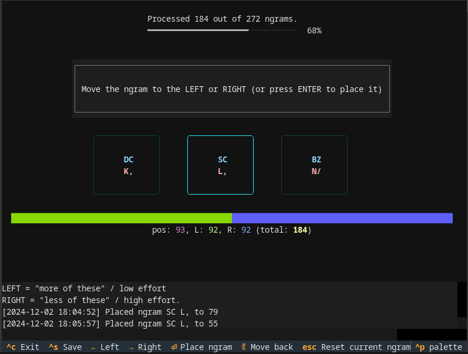
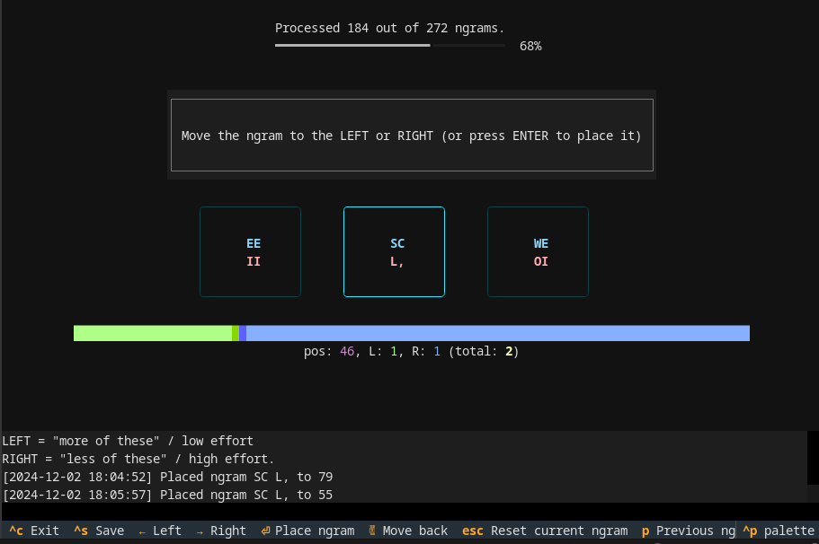
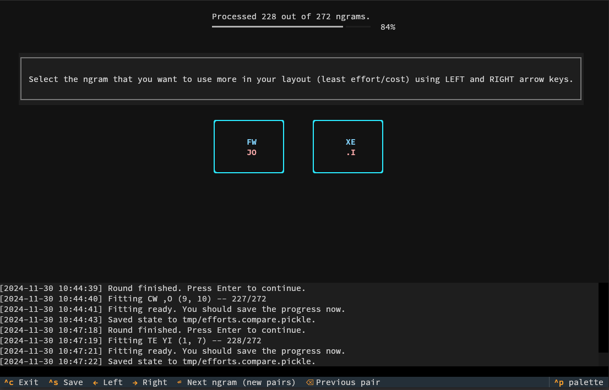
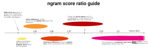
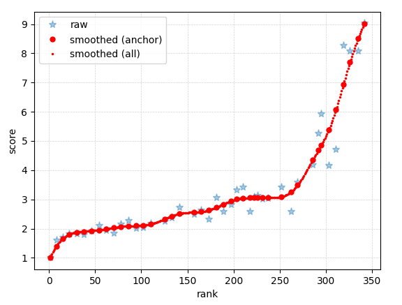
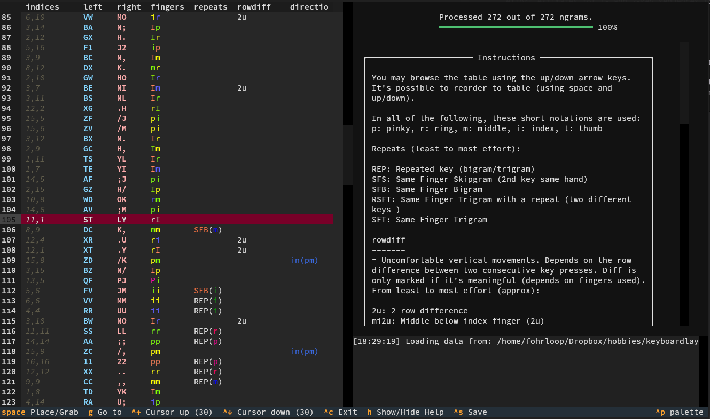

# Scoring Key Efforts

The [granite-tools](https://github.com/fohrloop/granite-tools) provides a toolkit for creating effort estimates for 1- and 2-key sequences for keyboard layout optimization.

> [!NOTE]
> If you're using [uv](https://docs.astral.sh/uv/), you can use `uv run command` to replace  `command` and `uv run somescript.py` to replace `python somescript.py` below.


# How to use this?

The full process is:

1. **Granite config file (yaml)**: Create a keyboard configuration yaml file.
2. **Initial bigram ranking**: Create initial ranking/ordering with `granite-bigram-ranking-initial`.
3. **View the initial order** (optional): Use the `granite-bigram-ranking-view` view or fine tune the initial order. 
4. **Create comparison file**. Use the `granite-bigram-compare`  to create comparisons of different key sequences. 
5. **Create bigram (and unigram) ranking file** using `python create_ngram_ranking.py <some.compare.pickle>`. The output file will be called `some.compare.ranking`.
6. **Create bigram (and unigram) score ratio file** using `granite-bigram-score-ratio-template` and filling up the template.
7. **Create bigram (and unigram) scores** based on score ratios
8. **Create trigram scoring file**: Hint: use `granite-trigram-score-template` for creating the trigram scoring template.
9. **Fit the trigram coefficients**: Use `granite-trigram-model-fit` to fit the trigram coefficients.


> [!TIP]
> You can actually use the `granite-bigram-ranking-view`  at _any point_ to make adjustments to a ngram ranking file if you wish.

### (1) Granite config file (yaml)

Create a keyboard configuration yaml file. Copy the `examples/config.yml` and use it as a base.

### (2) Initial bigram ranking

Create initial ordering for the bigrams (and unigrams) with `granite-bigram-ranking-initial`. This takes approximately 4.5 hours (16 keys per side). 

Tip: It's possible to use the `granite-bigram-ranking-view` also with partial initial order file (e.g. if you find something that's a bit off while working with `granite-bigram-ranking-initial`).

**Usage**:

```
❯ granite-bigram-ranking-initial <ngram-ranking-file> <config-file-yml>
```

where `<ngram-ranking-file>` is the path to the output file (created by the app) and `<config-file-yml>` is path to the granite configuration file created in step 1.

**Example**:

```
❯ granite-bigram-ranking-initial myfile examples/config.yml
```


### Screenshots from granite-bigram-ranking-initial





### (3) View the initial order (optional)

Use the `granite-bigram-ranking-view` to see the initial order. You may also do some fine tuning to the order.

Example:

```
❯ granite-bigram-ranking-view tmp/granite.ranking examples/config.yml
```

### (4) Create comparison file

Use the `granite-bigram-compare` with the initial order to create comparisons of different key sequences.  This takes approximately 12 hours (16 keys per side). This produces a `.compare.pickle` file.


**Usage**:

```
❯ granite-bigram-compare <ngram-ranking-file|saved-pickle-file> <config-file-yml>
```

where

-  `<ngram-ranking-file>` is a key sequence ranking file one created with `granite-bigram-ranking-initial` or saved with `granite-bigram-ranking-view`. (in case you start creating a new comparison file)
- `<saved-pickle-file>` is a `*.compare.pickle` file saved with `granite-bigram-compare` (in case you want to continue ngram comparison progress)
- `<config-file-yml>` is your granite config YAML file.

**Example**:

```
❯ granite-bigram-compare myfile examples/config.yml
```

- In this application, you will score each key sequence (ngram) 10 times against a random key sequence (normally distributed around the left pair). The order is updated after every round (10 comparisons).
- You typically first time load from the file created with `granite-bigram-ranking-initial` and subsequent times you'll load from the saved `.compare.pickle` file (See also: [.compare.pickle format](compare-pickle-format.md))

##### Screenshots from granite-bigram-compare



### (5) Create bigram (and unigram) ranking file

Exract the bigram ranking file from the `.compare.pickle` file using:

```
python granite_tools/scripts/granite_tools/scripts/create_ngram_ranking.py <some.compare.pickle>
```

The output file will be called `some.compare.ranking`, which contains all the unigrams and bigrams in rank order (easiest on the top of the file, most difficult at the bottom).

> [!TIP]
> You can use the `granite-bigram-ranking-view`  at _any point_ to make adjustments to the ngram ranking file if you wish.


### (6) Create bigram (and unigram) score ratio file

Before continuing, it's a good idea to do the last check for the ordering of the ngrams in your ngram ranking file. For example:

```
❯ granite-bigram-ranking-view tmp/granite.ranking examples/config.yml
```

After you're confident that the ordering is what you'd like, run:

```
❯ granite-bigram-score-ratio-template <ngram-ranking-file> <config-file-yml> <scoreratio-template-file-out-yml>
```

Example:

```
❯ granite-bigram-score-ratio-template tmp/some.compare.ranking examples/config.yml tmp/some.scoreratios.yml
```

to create a template and fill in the details. Example:

```yaml
- ref: ".M"
  ngram: "LP"
  score_ratio: 4.1

- ref: "@U"
  ngram: ",2"
  score_ratio: 1.78

- ref: "D+"
  ngram: "AG"
  score_ratio: 1.4

- ref: "N."
  ngram: "Y^"
  score_ratio: 1.13

...
```

> [!NOTE]
> The `score_ratio` should be `score(ngram) / score(ref)`. As the smaller rank ngram is used as the ref, most of the `score_ratios` should be 1.0 or larger.

> [!IMPORTANT]
> It's important to be consistent with your score ratios. You may use the example scoring below as a guideline.




### (7) Create bigram (and unigram) scores based on score ratios

This part can be a bit iterative and requires some level of patience. Any outliers in the score_ratio file should be fixed. 

### Fit the model

First, fit the model. This creates raw anchor nrgram scores (JSON) file for the scores of the anchor ngrams (anchor ngrams are the ngrams included in the score ratios of the scoreratio file). The command is:

```
[python | uv run] granite_tools/scripts/scoreratios_fit.py [config_file] [bigram_ranking_file] [bigram_scoreratio_file] [bigram_raw_anchor_scores_json]
```

where the `bigram_raw_anchor_scores_json` defines the output file.
**Example**:

```
uv run granite_tools/scripts/scoreratios_fit.py examples/config.yml tmp/granite.ranking tmp/granite.bigram.scoreratios.yml tmp/bigram-anchor-scores-raw.json
```

**Note**: This step may run 5-10 minutes depending on the data and power of the CPU in use.

The output will be a JSON file like this:

```json
{"(18,)": 1.0, "(2,)": 1.6183130049926346, "(18, 8)": 1.6941116897431308, "(12, 6)": 1.8170985207530244, ...
```

#### Plot the model output

You may plot the bigram (and unigram) scores with:

    python granite_tools/scripts/scoreratios_plot.py [config_file] [bigram_ranking_file] [bigram_raw_anchor_scores_json]

Example:

    python granite_tools/scripts/scoreratios_plot.py examples/config.yml tmp/granite.ranking tmp/bigram-anchor-scores-raw.json

Example output:



The example above looks good. The "raw" data points (for anchor ngrams) are quite close to the smoothed spline curve. If they are not, you may either:

- Check worst fit score ratios and fix the associated score ratios (see below)
- Use `granite-bigram-ranking-view` to move ngrams in rank order (left or right in the figure), if you think all the score ratios are correct.
- Remove some anchor ngram if you think all the associated score ratios are wrong (for example, "Q". Note that you should not remove the highest or lowest ranked ngram)

**TIP**: In addition, you may use

    python granite_tools/scripts/plot_bigram_scores.py examples/config.yml tmp/granite.ranking  tmp/bigram-anchor-scores-raw.json bigramscores.svg

To show more detailed view of the final fit (saved to bigramscores.svg).

#### Checking worst fit score ratios
The `scoreratios_show_worst_fit` can be used to check for the score ratios with worst fit. For example:

```
python granite_tools/scripts/scoreratios_show_worst_fit.py examples/config.yml tmp/granite.ranking tmp/granite.bigram.scoreratios.yml tmp/bigram-anchor-scores-raw
.json
```

It's a good idea to fix large negative `log2err` (the score ratios you estimated too high and which should be lowered a bit). The score ratios between unigrams and bigrams do not matter too much.

#### Removing ngrams from scoreratio file
If the "Q" unigram was selected to be one of the anchor ngrams (included in the score ratio file), you might want to remove it with `scoreratios_modify.py`. For example:

```
python granite_tools/scripts/scoreratios_modify.py examples/config.yml tmp/granite.scoreratios-fixed.yml --remove Q
```

#### When to continue to the next step?

When the plot generated with `scoreratios_plot.py` look okay to you and you are generally satisfied with the ngram ordering and their scores.

### (8) Create trigram scoring file

Create a `some-trigram.relative.toml` file with the format:

```toml
["SEF"]
"EFL" = 0.8
"ELF" = 1.5
"ESF" = 2.0

[".KY"]
"XKY" = 0.4
".TK" = 0.75
"Y.K" = 1.35

["XDG"]
".DG" = 0.5
"XHD" = 1.0
"DGX" = 2.2

["VCX"]
...
```

Each "section" is a *trigram family subset*. The "title" should generally be a onehand trigram (not a redir and typed with single hand), but of course you can use there anything. That is going to be used a the *reference*. The scores listed below should have have a

- redir trigram
- balanced trigram
- alternating trigram

Each trigram family uses it's own separate *relative* score scale; The scores are relative to the *reference*. For example in the above toml file:

- `["SEF"]` is a reference. (always implicitly means score 1.0)
- `"ESF" = 2.0` means that "ESF" has 2.0 times the score of "SEF". The ESF is a redir.
- `"EFL" = 0.8` means that "EFL" has 0.8 times the score of "SEF". The EFL is "balanced" (2 keys on one side, 1 key on other side)
- `"ELF" = 1.5` means that "ELF` has 1.5 times the score of "SEF". The ELF is a "alternating" type (1 key on one side, then 1 key on other side and 1 key on the original side)

This takes about 2 hours per 200 trigrams (50 trigram sets).

> [!TIP]
> It is recommended to have **at least 200 trigram sets** in the file. More it better. You may also add more trigrams to each set of the template manually.

### template for trigram scores

You can use `granite-trigram-score-template` for creating the trigram scoring template:

    granite-trigram-score-template [OPTIONS] CONFIG_FILE OUTFILE [N_TRIGRAM_SETS]

For example:

    granite-trigram-score-template examples/config.yml tmp/trigram.relative.toml 250

Running `granite-trigram-score-template` with same `OUTFILE` as argument will _append_ more trigram sets (that are NOT already in the file). That's a handy way for adding more data to the file afterwards.

### (9) Fit the trigram coefficients

Use `granite-trigram-model-fit` to fit the trigram coefficients.

**Example**:

```
granite-trigram-model-fit examples/config.yml tmp/granite.bigram.ranking tmp/bigram-anchor-scores-raw.json tmp/granite.trigram.scoreratios.yml
```

the results can be checked with:

```
granite-trigram-model-fit-check examples/config.yml tmp/granite.bigram.ranking tmp/bigram-anchor-scores-raw.json tmp/granite.trigram.scoreratios.yml
```

## granite-bigram-ranking-view

Application for viewing and reordering an ordered ngram table (ngram ranking file). Launch:

```
❯ granite-bigram-ranking-view <ngram-ranking-file> <config-file-yml>
```

for example:

```
❯ granite-bigram-ranking-view myfile examples/config.yml
```

> [!TIP]
> Note that it's also possible to fine tune the order here; you may use space key and arrow up/down to move rows one by one. Just remember to save your progress (it overwrites the original file).


> [!CAUTION]
> Do not open the file in two processes at the same time; that will most likely lead to data loss!


### Screenshots from granite-bigram-ranking-view



