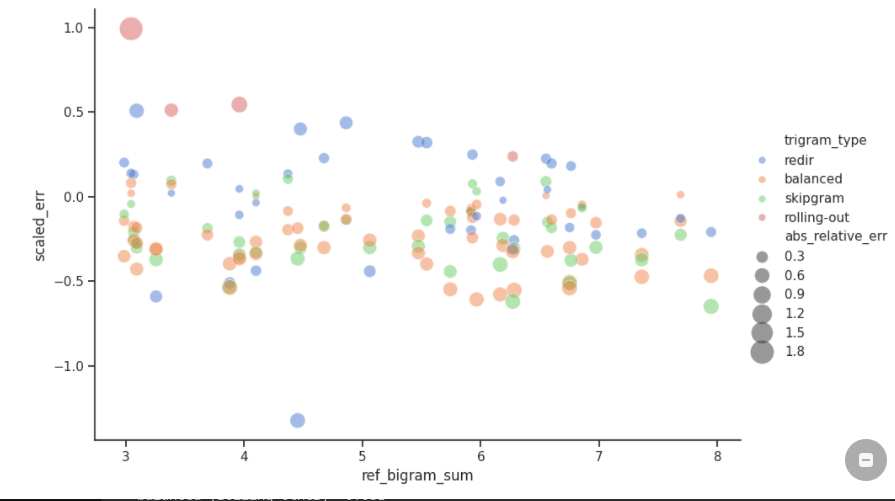
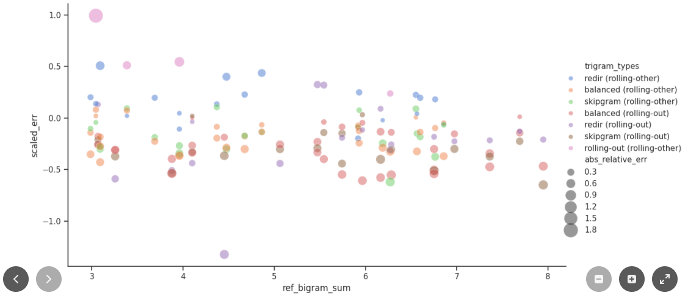
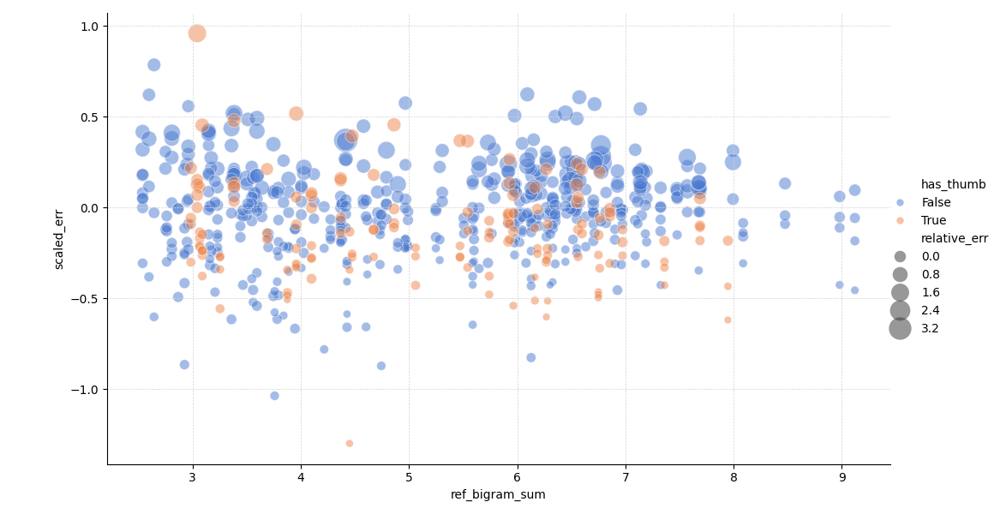
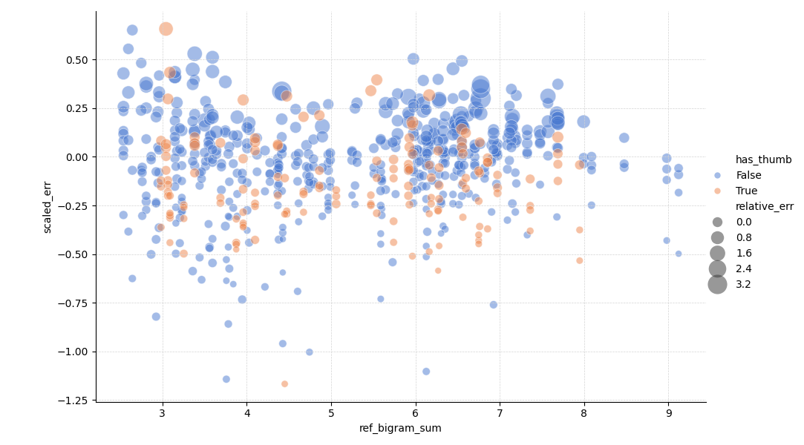
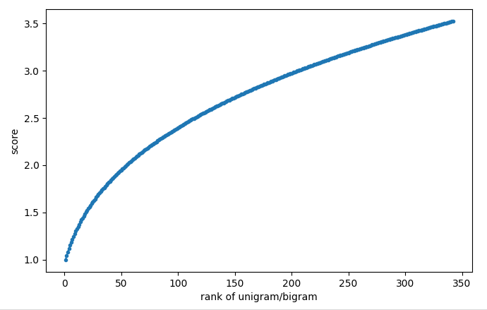

# Thumb key

When reference trigram is:

- **inwards rolling**  (rolling-other), score ratio residual (scaled_err) is increased as reference trigram scores are too low. (Thumb as last makes trigram worse)
- **outwards rolling** (rolling-out), score ratio residual is decreased as reference trigram scores are too high (Thumb as first makes trigram easier)


Here are the errors colored by the trigram type:



And here by the combined type; trigram (ref trigram):



# Testing different models

I had a feeling that the old model was getting too complex. Especially, when addition of thumb keys would necessitate inclusion of trigram types: "outward rolling with thumb keys" and "inward rolling with thumb keys".

Old model:

```
onehand = rolling * dirchange * vert2u * sgb * sft * (3/4) * (b1+b2)
```

where `b1` and `b2` are the scores of the bigrams in the trigram (AB & BC in ABC), the `rolling` is one of

```
easy_rolling_coeff
outward_rolling_coeff
inward_roll_coeff (=1.0)
non_rolling_coeff (redir/samecol)
```

Let's call the coeffs


```
extra =  dirchange * vert2u * sfb * sft 
```


so we get

```
onehand = rolling * extra * (3/4) * (b1+b2)
```

### model proposal 1

```
m1 = extra * (3/4) * (B1+B2)
```

The difference here is that the scores of the bigrams b1 and b2 are transformed through a non-linear transformation to first make them to be linear in scale 1 to Bmax, and then you take power of k:

```
B = rescale(b)^k
```

Same transformed bigram and unigram values are to be used also with the balanced and skipgram type of trigrams:

```
balanced = a_b * B + a_u * U
skipgram = a_s * B + a_u * U
```

### model proposal 2

```
m2 = easy_roll_multiplier * extra * (3/4) * (B1+B2)
```

# Testing the models

The procedure will be 

1. split to train and validation data
2. Use train data to train model
3. Use validation data to check the model performance

# Cross validations

Using

```
uv run granite_tools/scripts/cross_validate_model.py examples/config.yml tmp/granite.ranking tmp/trigram.relative.toml 
```

## old model

```
Training scores: [0.25794562524559855, 0.25578470798165887, 0.25748500674408126, 0.24939809290555462, 0.257338172878367, 0.24870426164797788, 0.2597034269000717, 0.2586274006309147, 0.25597680819858815, 0.2549302195937648]
Validation scores: [0.2350720098978947, 0.2576228763095137, 0.24192101907570232, 0.31048548450559643, 0.24299206063829396, 0.31786327315830193, 0.21817670751632953, 0.2278119384436215, 0.255377349829764, 0.263342494716347]

Training score mean: 0.2556
Training score std: 0.0035
Validation score mean: 0.2571
Validation score std: 0.0314
```

2 folds:

```
Training scores: [0.27081445854447617, 0.23290886882583997]
Validation scores: [0.24623596517770815, 0.2840313477665733]

Training score mean: 0.2519
Training score std: 0.0190
Validation score mean: 0.2651
Validation score std: 0.0189
```

thumb/no thumb (RMSE)

```
Training score (no thumbs): 0.24927579701498456
Validation score (thumbs): 0.29725541001697386
```

Here's scatter plot created with

- Fit all non-thumb data (n=514) using the old model, and get parameters set.
- Use the parameter set to plot both, the non-thumb data (n=514) and the thumb data (n=146)



What can be seen:

- When the model is fitted without thumbs and used ngrams with thumb keys (red), the model error on ngrams including thumb keys is not random. Instead, it shows a slight negative slope. This is an indication of some sort of model error.

## CV: model proposal 2

```
139 training trigrams, 38 validation trigrams
/home/fohrloop/code/granite-tools/granite_tools/scorer/scorer.py:853: RuntimeWarning: Maximum number of function evaluations has been exceeded.
  res = minimize(
vert2u_coeff=1.2039167126853263 dirchange_coeff=1.1621138250645737 balanced_b_coeff=0.5100267395726639 unigram_coeff=0.07653316759558848 skipgram_b_coeff=0.6229641821509877 easy_rolling_coeff=0.4698306323067246 bigram_raw_range_max=27.545842474602736 bigram_scaling_exponent=0.38730836707148253 sft_coeff=2.0 sfb_in_onehand_coeff=1.03
Finished at: 2024-12-27 18:57:27.919911

Training score (no thumbs) - ave: 0.022674483059900767, rmse: 0.25427666434728313, max: 1.14270933177327
Validation score (thumbs) - ave: 0.13883912331035853,  rmse: 0.2680340493424864, max: 1.167104810196594
```

The scores as scatter plot (train without thumb keys, look at all scores):



Some observations:

1. The optimization function does not converge well. Could it be because the transformation is

```
B = rescale(b, newmax)^k 
```

which means that the optimizer has two parameters which affect the max bigram score: The "newmax" and "k". What I also do not like are the seemingly unphysical optimized parameter values:

```
vert2u_coeff: 1.132
dirchange_coeff: 1.183
balanced_b_coeff: 0.611
unigram_coeff: -0.004
skipgram_b_coeff: 0.708
easy_rolling_coeff: 0.476
bigram_raw_range_max: 48.781
bigram_scaling_exponent: 0.324
```

The `unigram_coeff: -0.004` would mean that the worse the unigram in the "balanced" or "skipgram", the less the trigram score is. Or since it's _very_ close to zero, the unigram has no effect to the score; only the bigram of balanced trigram or the skipgram has any effect to the final score.. The "rescaled" unigram and bigram scores are:

